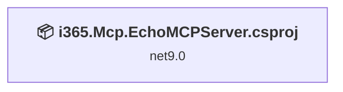
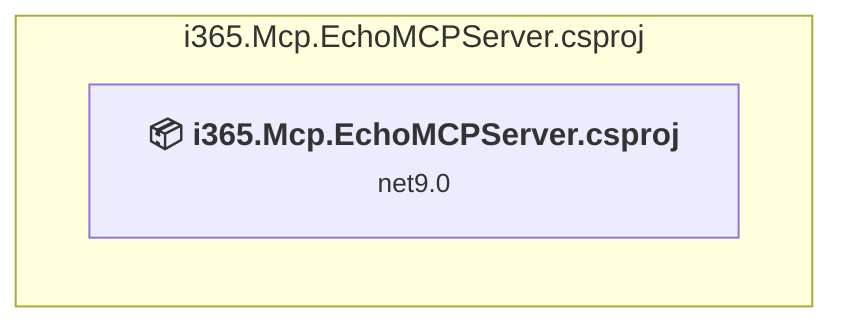

# Projects and dependencies analysis

This document provides a comprehensive overview of the projects and their dependencies in the context of upgrading to .NETCoreApp,Version=v10.0.

## Table of Contents

- [Executive Summary](#executive-Summary)
  - [Highlevel Metrics](#highlevel-metrics)
  - [Projects Compatibility](#projects-compatibility)
  - [Package Compatibility](#package-compatibility)
  - [API Compatibility](#api-compatibility)
- [Aggregate NuGet packages details](#aggregate-nuget-packages-details)
- [Top API Migration Challenges](#top-api-migration-challenges)
  - [Technologies and Features](#technologies-and-features)
  - [Most Frequent API Issues](#most-frequent-api-issues)
- [Projects Relationship Graph](#projects-relationship-graph)
- [Project Details](#project-details)

  - [i365.Mcp.EchoMCPServer.csproj](#i365mcpechomcpservercsproj)

## Executive Summary

### Highlevel Metrics

| Metric | Count | Status |
| :--- | :---: | :--- |
| Total Projects | 1 | All require upgrade |
| Total NuGet Packages | 6 | 2 need upgrade |
| Total Code Files | 2 |  |
| Total Code Files with Incidents | 2 |  |
| Total Lines of Code | 270 |  |
| Total Number of Issues | 42 |  |
| Estimated LOC to modify | 39+ | at least 14.4% of codebase |

### Projects Compatibility

| Project | Target Framework | Difficulty | Package Issues | API Issues | Est. LOC Impact | Description |
| :--- | :---: | :---: | :---: | :---: | :---: | :--- |
| [i365.Mcp.EchoMCPServer.csproj](#i365mcpechomcpservercsproj) | net9.0 | 🟢 Low | 2 | 39 | 39+ | DotNetCoreApp, Sdk Style = True |

### Package Compatibility

| Status | Count | Percentage |
| :--- | :---: | :---: |
| ✅ Compatible | 4 | 66.7% |
| ⚠️ Incompatible | 0 | 0.0% |
| 🔄 Upgrade Recommended | 2 | 33.3% |
| ***Total NuGet Packages*** | ***6*** | ***100%*** |

### API Compatibility

| Category | Count | Impact |
| :--- | :---: | :--- |
| 🔴 Binary Incompatible | 1 | High - Require code changes |
| 🟡 Source Incompatible | 37 | Medium - Needs re-compilation and potential conflicting API error fixing |
| 🔵 Behavioral change | 1 | Low - Behavioral changes that may require testing at runtime |
| ✅ Compatible | 412 |  |
| ***Total APIs Analyzed*** | ***451*** |  |

## Aggregate NuGet packages details

| Package | Current Version | Suggested Version | Projects | Description |
| :--- | :---: | :---: | :--- | :--- |
| Azure.Storage.Blobs | 12.27.0 |  | [i365.Mcp.EchoMCPServer.csproj](#i365mcpechomcpservercsproj) | ✅Compatible |
| Microsoft.AspNetCore.Authentication.JwtBearer | 9.0.8 | 10.0.8 | [i365.Mcp.EchoMCPServer.csproj](#i365mcpechomcpservercsproj) | NuGet package upgrade is recommended |
| Microsoft.Extensions.Hosting | 10.0.2 | 10.0.8 | [i365.Mcp.EchoMCPServer.csproj](#i365mcpechomcpservercsproj) | NuGet package upgrade is recommended |
| Microsoft.Identity.Web | 4.10.0 |  | [i365.Mcp.EchoMCPServer.csproj](#i365mcpechomcpservercsproj) | ✅Compatible |
| ModelContextProtocol | 0.7.0-preview.1 |  | [i365.Mcp.EchoMCPServer.csproj](#i365mcpechomcpservercsproj) | ✅Compatible |
| ModelContextProtocol.AspNetCore | 0.7.0-preview.1 |  | [i365.Mcp.EchoMCPServer.csproj](#i365mcpechomcpservercsproj) | ✅Compatible |

## Top API Migration Challenges

### Technologies and Features

| Technology | Issues | Percentage | Migration Path |
| :--- | :---: | :---: | :--- |

### Most Frequent API Issues

| API | Count | Percentage | Category |
| :--- | :---: | :---: | :--- |
| P:Microsoft.AspNetCore.Authentication.OpenIdConnect.OpenIdConnectOptions.Scope | 5 | 12.8% | Source Incompatible |
| P:Microsoft.AspNetCore.Authentication.JwtBearer.JwtBearerEvents.OnForbidden | 3 | 7.7% | Source Incompatible |
| P:Microsoft.AspNetCore.Authentication.JwtBearer.JwtBearerEvents.OnChallenge | 3 | 7.7% | Source Incompatible |
| P:Microsoft.AspNetCore.Authentication.JwtBearer.JwtBearerEvents.OnAuthenticationFailed | 3 | 7.7% | Source Incompatible |
| P:Microsoft.AspNetCore.Authentication.JwtBearer.JwtBearerEvents.OnTokenValidated | 3 | 7.7% | Source Incompatible |
| P:Microsoft.AspNetCore.Authentication.JwtBearer.JwtBearerEvents.OnMessageReceived | 3 | 7.7% | Source Incompatible |
| T:Microsoft.AspNetCore.Authentication.JwtBearer.JwtBearerEvents | 3 | 7.7% | Source Incompatible |
| P:Microsoft.AspNetCore.Authentication.JwtBearer.JwtBearerOptions.Events | 2 | 5.1% | Source Incompatible |
| P:Microsoft.AspNetCore.Authentication.OpenIdConnect.OpenIdConnectOptions.GetClaimsFromUserInfoEndpoint | 1 | 2.6% | Source Incompatible |
| P:Microsoft.AspNetCore.Authentication.OpenIdConnect.OpenIdConnectOptions.ResponseType | 1 | 2.6% | Source Incompatible |
| M:Microsoft.Extensions.Configuration.ConfigurationBinder.GetValue''1(Microsoft.Extensions.Configuration.IConfiguration,System.String) | 1 | 2.6% | Binary Incompatible |
| P:Microsoft.AspNetCore.Authentication.OpenIdConnect.OpenIdConnectOptions.ClientId | 1 | 2.6% | Source Incompatible |
| P:Microsoft.AspNetCore.Authentication.OpenIdConnect.OpenIdConnectOptions.Authority | 1 | 2.6% | Source Incompatible |
| T:Microsoft.AspNetCore.Authentication.OpenIdConnect.OpenIdConnectDefaults | 1 | 2.6% | Source Incompatible |
| F:Microsoft.AspNetCore.Authentication.OpenIdConnect.OpenIdConnectDefaults.AuthenticationScheme | 1 | 2.6% | Source Incompatible |
| P:Microsoft.AspNetCore.Authentication.JwtBearer.JwtBearerChallengeContext.ErrorDescription | 1 | 2.6% | Source Incompatible |
| P:Microsoft.AspNetCore.Authentication.JwtBearer.JwtBearerChallengeContext.Error | 1 | 2.6% | Source Incompatible |
| P:Microsoft.AspNetCore.Authentication.JwtBearer.AuthenticationFailedContext.Exception | 1 | 2.6% | Source Incompatible |
| M:Microsoft.AspNetCore.Authentication.JwtBearer.JwtBearerEvents.#ctor | 1 | 2.6% | Source Incompatible |
| T:Microsoft.AspNetCore.Authentication.JwtBearer.JwtBearerDefaults | 1 | 2.6% | Source Incompatible |
| F:Microsoft.AspNetCore.Authentication.JwtBearer.JwtBearerDefaults.AuthenticationScheme | 1 | 2.6% | Source Incompatible |
| M:Microsoft.Extensions.Logging.ConsoleLoggerExtensions.AddConsole(Microsoft.Extensions.Logging.ILoggingBuilder,System.Action{Microsoft.Extensions.Logging.Console.ConsoleLoggerOptions}) | 1 | 2.6% | Behavioral Change |

## Projects Relationship Graph

Legend:
📦 SDK-style project
⚙️ Classic project

## Project Details

### i365.Mcp.EchoMCPServer.csproj

#### Project Info

- **Current Target Framework:** net9.0
- **Proposed Target Framework:** net10.0
- **SDK-style**: True
- **Project Kind:** DotNetCoreApp
- **Dependencies**: 0
- **Dependants**: 0
- **Number of Files**: 2
- **Number of Files with Incidents**: 2
- **Lines of Code**: 270
- **Estimated LOC to modify**: 39+ (at least 14.4% of the project)

#### Dependency Graph

Legend:
📦 SDK-style project
⚙️ Classic project

### API Compatibility

| Category | Count | Impact |
| :--- | :---: | :--- |
| 🔴 Binary Incompatible | 1 | High - Require code changes |
| 🟡 Source Incompatible | 37 | Medium - Needs re-compilation and potential conflicting API error fixing |
| 🔵 Behavioral change | 1 | Low - Behavioral changes that may require testing at runtime |
| ✅ Compatible | 412 |  |
| ***Total APIs Analyzed*** | ***451*** |  |

